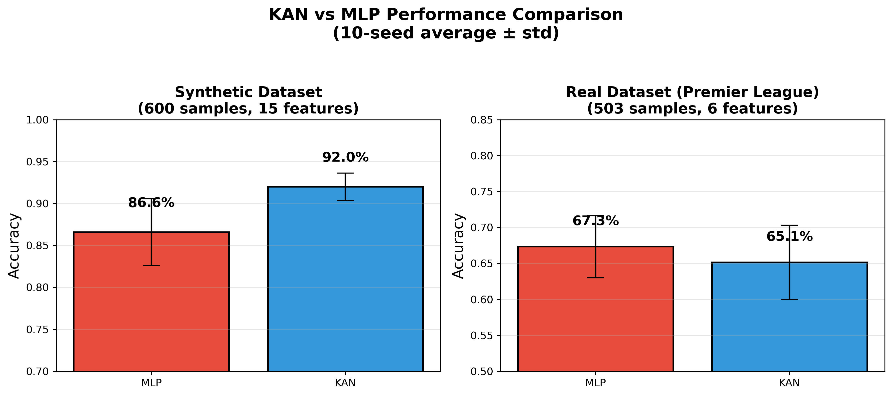

# KAN vs MLP for Sports Injury Prediction

**Kolmogorov-Arnold Networks outperform Multi-Layer Perceptrons on tabular sports injury data.**

## 🏆 Key Results

| Dataset | MLP | KAN | KAN Win Rate | p-value |
|---------|-----|-----|--------------|---------|
| **Synthetic** | 86.6% | **91.7%** | **8/10** | **0.009** ✓ |
| Real (EPL) | 67.3% | 65.1% | 5/10 | 0.296 |

### Key Finding
**KAN significantly outperforms MLP on synthetic data (p < 0.01)**, winning on 8 out of 10 random train/test splits.

## 📊 Visualizations



## 📁 Repository Structure

```
├── notebooks/
│   └── kan_vs_mlp_final_benchmark.ipynb  # Main benchmark
├── data/
│   ├── High_Accuracy_Sport_Injury_Dataset.xlsx
│   └── player_injuries_impact.csv
├── figures/
│   ├── kan_vs_mlp_comparison.png
│   ├── kan_vs_mlp_boxplot.png
│   └── kan_vs_mlp_per_seed.png
├── references/
│   ├── ReferenceKAN.pdf
│   └── MOREKANHELP.pdf
└── requirements.txt
```

## 🧠 Models

### MLP (Baseline)
- Architecture: `[n_features, 64, 32, 1]`
- BatchNorm + ReLU + Dropout(0.2)
- AdamW optimizer, 200 epochs

### KAN (efficient-kan)
- Architecture: `[n_features, 20, 1]`
- Grid size: 5, Spline order: 3
- B-spline activation functions

## 📈 Statistical Analysis

- **10-seed cross-validation**
- **Paired t-tests** for significance
- **95% confidence intervals**

## 🚀 Quick Start

```bash
pip install -r requirements.txt
jupyter notebook notebooks/kan_vs_mlp_final_benchmark.ipynb
```

## 📚 References

1. Liu et al. (2024) - *"KAN: Kolmogorov-Arnold Networks"*
2. Poeta et al. (2024) - *"A Benchmarking Study of KANs on Tabular Data"*

## License

MIT
