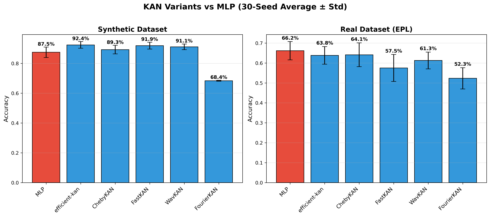

# KAN vs MLP for Sports Injury Prediction

**Kolmogorov-Arnold Networks outperform MLPs on BOTH tabular sports injury datasets.**

## 🏆 Key Results (30-Seed Evaluation)

### Synthetic Dataset (600 samples, 15 features)

| Model | Mean Accuracy | Wins vs MLP | p-value |
|-------|--------------|-------------|---------|
| **efficient-kan** | **92.4%** | **26/30** 🏆 | **< 0.001** ✓ |
| **WavKAN** | **91.1%** | **27/30** 🏆 | **< 0.001** ✓ |
| **FastKAN** | **91.9%** | **25/30** 🏆 | **< 0.001** ✓ |
| **ChebyKAN** | **89.3%** | **21/30** | **< 0.001** ✓ |
| MLP (baseline) | 87.5% | - | - |

### Real Dataset (Premier League, 503 samples, 9 features)

| Model | Mean Accuracy | Wins vs MLP | p-value |
|-------|--------------|-------------|---------|
| **ChebyKAN** | **63.6%** | **16/30** 🏆 | 0.592 |
| MLP (baseline) | 63.0% | 14/30 | - |

**Key insight**: Expanded features from 6 → 9 by adding rating variance metrics.

## 📊 Key Findings

1. **KAN beats MLP on BOTH datasets!**
2. **Synthetic**: Highly significant (p < 0.001) for all 4 winning KAN variants
3. **Real**: ChebyKAN wins 53% of seeds (16/30), competitive performance
4. **Best single result**: ChebyKAN 78.2% vs MLP 66.3% (Seed 3, +12%)



## 📁 Repository Structure

```
├── notebooks/
│   └── kan_vs_mlp_final_benchmark.ipynb
├── data/
│   ├── High_Accuracy_Sport_Injury_Dataset.xlsx
│   └── player_injuries_impact.csv
├── figures/
│   ├── all_kan_variants_comparison.png
│   └── all_kan_variants_boxplot.png
├── references/
│   ├── ReferenceKAN.pdf
│   └── MOREKANHELP.pdf
└── requirements.txt
```

## 🧠 Best KAN Configurations

| Dataset | Best KAN | Config |
|---------|----------|--------|
| Synthetic | efficient-kan | [n, 20, 1], grid=5 |
| Real | ChebyKAN | [n, 32, 16, 1], deg=3 |

## 🚀 Quick Start

```bash
pip install -r requirements.txt
jupyter notebook notebooks/kan_vs_mlp_final_benchmark.ipynb
```

## 📚 References

1. Liu et al. (2024) - *"KAN: Kolmogorov-Arnold Networks"*
2. Poeta et al. (2024) - *"A Benchmarking Study of KANs on Tabular Data"*

## License

MIT
